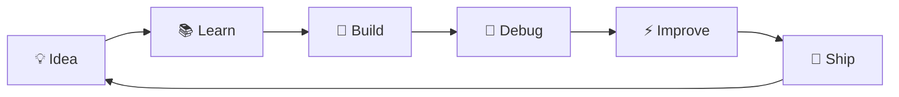

# 👋 Hey, I'm Navpreet Kaur

### `CSE Student` · `AI/ML` · `Unreal Engine` · `Software Engineering`

  

  
  
  

  <b>AI/ML learner</b> · <b>Unreal Engine developer</b> · <b>Full-stack builder</b> · <b>DSA enthusiast</b>

---

## 🧭 What I'm Building

<table align="center">
<tr>

<td width="33%" align="center">

### 🤖 AI / ML

Practical AI systems

`NLP` · `CV`
`Deep Learning` · `Agents`

</td>

<td width="33%" align="center">

### 🎮 Game Dev

Interactive experiences

`UE5` · `Blueprints`
`Gameplay` · `AI`

</td>

<td width="33%" align="center">

### 💻 Software

Applications & CS fundamentals

`Java` · `Python`
`MERN` · `DSA`

</td>

</tr>
</table>

---

## 🚀 Featured Projects

<table align="center">
<tr>

<td width="50%" align="center" valign="top">

### 🎮 Echoes of the Valley

**3D Endless Runner**

A forest endless runner where players avoid obstacles, collect coins and chase high scores.

**Tech**

`UE5` · `Blueprints` · `Animation`
`Physics` · `UMG`

 

<a href="https://github.com/NavpreetKaur-cs/Endless_Runner">GitHub ↗</a>
  ·   <a href="https://nkverse.itch.io/echoes-of-the-valley">Play ↗</a>

</td>

<td width="50%" align="center" valign="top">

### 👁️ The Last Student

**First-Person Horror**

A horror game combining exploration, puzzles and enemy AI in an atmospheric college setting.

**Tech**

`UE5` · `C++` · `Blueprints`
`Behavior Trees` · `Blackboards`

 

<a href="https://github.com/NavpreetKaur-cs/The-Last-Student">GitHub ↗</a>
  ·   <a href="https://nkverse.itch.io/the-last-student">Play ↗</a>

</td>

</tr>

<tr>

<td width="50%" align="center" valign="top">

### 🛰️ SatQuery AI

**Agentic AI · Remote Sensing**

A natural-language interface for querying and analysing satellite imagery, developed collaboratively.

**My Work**

`Task Router` · `Query Routing`
`Tool Integration` · `AI Orchestration`

**Tech**

`Python` · `FastAPI` 
`Vite` · `Remote Sensing`

 

<a href="https://github.com/NavpreetKaur-cs/SatQueryAi">Repository ↗</a>

</td>

<td width="50%" align="center" valign="top">

### 🌐 Rental & Resale Platform

**Full-Stack Application**

A platform for renting and reselling items with listings, browsing and rental/sale functionality.

**Focus**

`Backend` · `REST APIs`
`Database` · `Application Logic`
`Authentication`

**Tech**

`JavaScript` · `Node.js`
`Express.js` · `MongoDB`

 

<a href="https://github.com/NavpreetKaur-cs/resale-rent-project">GitHub ↗</a>

</td>

</tr>

<tr>

<td width="50%" align="center" valign="top">

### 📝 NoteVault

**Full-Stack Notes Application**

A notes platform for creating, editing, searching and managing notes with authentication.

**Focus**

`CRUD` · `Authentication`
`REST APIs` · `Database`

**Tech**

`MERN` · `MongoDB`
`REST APIs`

 

<a href="https://github.com/NavpreetKaur-cs/Notes_website">GitHub ↗</a>

</td>

<td width="50%" align="center" valign="top">

### 🔭 More Coming Soon

**Currently Exploring**

Building more AI-focused projects while continuing to develop with Unreal Engine and modern software technologies.

**Exploring**

`Deep Learning` · `Computer Vision`
`VLMs` · `AI Agents`

**Focus**

`AI/ML` · `Multimodal AI`
`Research` · `Open Source`

</td>

</tr>
</table>

---

## 🧠 How I Build

<b>Learn → Build → Debug → Improve → Ship</b>

---

## 🛠️ Tech Stack

### 💻 Languages

  
  
  
  
  
  
  

### 🤖 AI / ML

  
  
  
  
  
  
  

### 🎮 Game Development

  
  
  
  
  

### 🌐 Web Development

  
  
  
  

### 🔧 Tools

  
  
  
  
  

---

## 📊 GitHub Activity

  
  

  

---

## 🧩 Problem Solving

<h3>300+ LeetCode Problems</h3>

---

## 🌐 Find Me

---

### `LEARN → BUILD → DEBUG → SHIP`

Building Experiences. Solving Problems. Making Impact.

